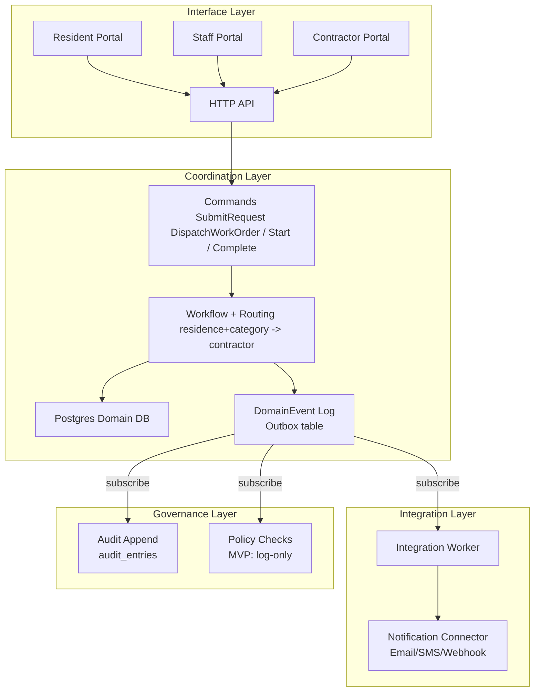
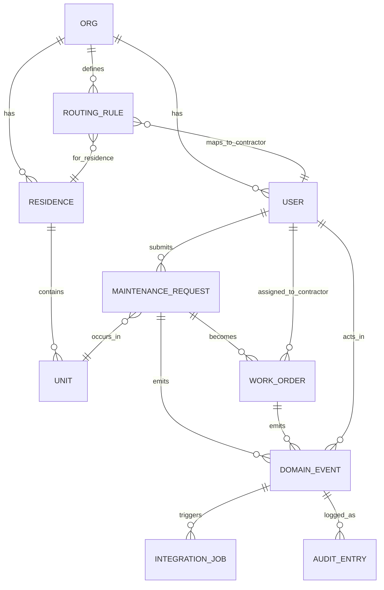
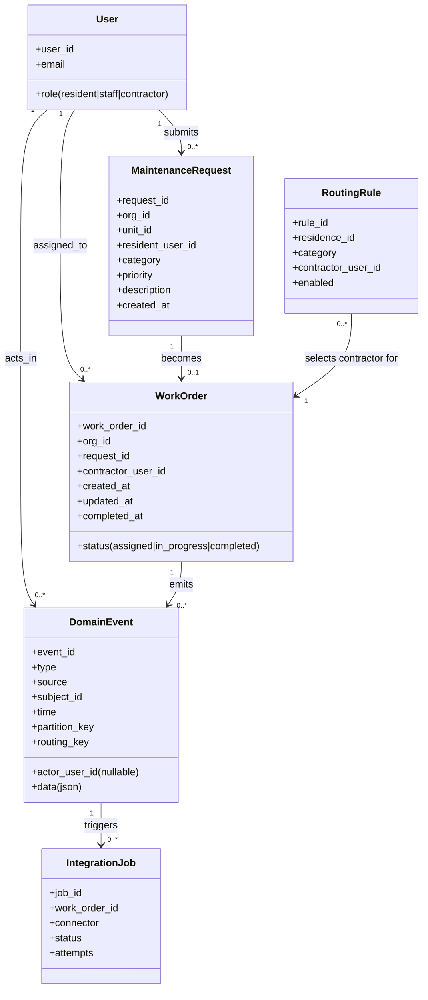
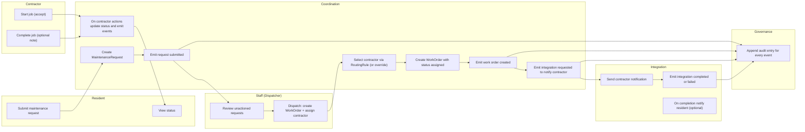

# UoN Student Living — Maintenance Coordination MVP (Resident ↔ Staff ↔ Contractor)

This MVP proves **external coordination** for residential maintenance: a resident submits a maintenance request, **staff dispatches** it into a work order (assigning a contractor), the contractor **starts + completes** the job, and the resident can see status updates.

Scope is locked to **Fields, Events, Routing** for a **2‑day build** (everything else is explicitly non-goal).

---

## 1-page spec (stop condition)

### Actors
- **Resident**: submits maintenance request; views status.
- **Staff (Dispatcher)**: reviews submitted requests; creates a WorkOrder from a request; assigns a contractor (via routing rules by default).
- **Contractor**: receives job notification; starts (accepts); completes; optionally adds a completion note (text).
- **System (Coordination)**: persists artifacts; applies routing rules; emits events.
- **Governance (internal)**: appends an audit entry for every event (no business ownership).

### Core artifacts
- `MaintenanceRequest` (resident-submitted)
- `WorkOrder` (coordination-owned workflow)
- `RoutingRule` (deterministic contractor selection)
- `DomainEvent` (event bus log / outbox table; append-only)
- `IntegrationJob` (tracks external side effects like notifications)
- `AuditEntry` (append-only audit append for every event)

### Minimal statuses
- WorkOrder status: `assigned` → `in_progress` → `completed`

### Minimal event types (MVP)
All events use a CloudEvents-like envelope (see below) and are append-only in the event log.

1) `uon.maintenance_request.submitted`  
2) `uon.work_order.created`  
3) `uon.work_order.status_changed`  (to `in_progress`, `completed`)  
4) `uon.integration.requested`       (notify contractor/resident)  
5) `uon.integration.completed` / `uon.integration.failed`

### Routing rules (MVP)
- `partition_key`:
  - maintenance_request events: `org_id`
  - work_order + integration events: `work_order_id` (keeps job timeline ordered)
- `routing_key` (deterministic from fields):
  - `org.<org_id>.residence.<residence_id>.category.<category>`
- Contractor selection is a pure function (routing rule):
  - `(residence_id, category) -> contractor_id`

### Side effects
- **On `work_order.created` (Coordination-owned):**
  - create `integration_job` rows for notifications (no external IO in the transaction)
- **In Integration worker (Integration-owned):**
  - send contractor notification (email/SMS/webhook)
  - send resident notification on completion (optional but useful)

Stop condition: if you implement exactly the above + diagrams below, you should not add more fields/events/endpoints for the MVP.

---

## API responsibilities (MVP)

This section defines the intended system behavior without tying it to implementation details (route modules, file names, or final URL paths). Treat this as the **contract** the schema supports.

### Auth
- login (email + password)
- identify current user (optional helper)
- logout (optional helper)

### Resident
- submit a maintenance request
- view request status (and the linked WorkOrder status once dispatched)

### Staff (Dispatcher)
- view submitted requests that do not yet have a WorkOrder
- create a WorkOrder from a request (dispatch)
- assign a contractor
  - default: via `RoutingRule (residence_id, category)`
  - optional override: specify contractor explicitly (MVP convenience)

### Contractor
- view assigned work orders
- start job (treat as “accept” in MVP; no separate accepted state)
- complete job (optional completion note)

### System / Integration
- create `IntegrationJob` rows when notifications are required
- process `IntegrationJob` rows and record results (completed / failed)

### Governance
- append an audit entry for every emitted domain event

---

## Endpoint table (MVP, indicative)

Paths are **illustrative**. The implementation may use different URLs as long as it supports the responsibilities above and emits the same events.

| Actor                |   Method | Endpoint (indicative)                         | Auth        | Purpose                                                       | Emits events                                           |
|----------------------|---------:|-----------------------------------------------|-------------|---------------------------------------------------------------|--------------------------------------------------------|
| Any                  |     POST | `/auth/login`                                 | None        | Login                                                         | —                                                      |
| Resident             |     POST | `/maintenance-requests`                       | Resident    | Create `MaintenanceRequest`                                   | `uon.maintenance_request.submitted`                    |
| Resident             |      GET | `/maintenance-requests`                       | Resident    | List resident requests                                        | —                                                      |
| Resident             |      GET | `/maintenance-requests/{request_id}`          | Resident    | View request + linked WorkOrder status                        | —                                                      |
| Staff                |      GET | `/staff/maintenance-requests?unactioned=true` | Staff       | List requests without a WorkOrder                             | —                                                      |
| Staff                |     POST | `/staff/work-orders`                          | Staff       | Dispatch: create `WorkOrder` from request + assign contractor | `uon.work_order.created`, `uon.integration.requested`  |
| Contractor           |      GET | `/contractor/work-orders?status=assigned      | in_progress | completed`                                                    | Contractor                                             | List contractor work orders | — |
| Contractor           |     POST | `/contractor/work-orders/{id}/start`          | Contractor  | Move WorkOrder → `in_progress`                                | `uon.work_order.status_changed`                        |
| Contractor           |     POST | `/contractor/work-orders/{id}/complete`       | Contractor  | Move WorkOrder → `completed` (+ optional note)                | `uon.work_order.status_changed`                        |
| System (integration) | (worker) | (worker)                                      | —           | Run `IntegrationJob` (notifications)                          | `uon.integration.completed` / `uon.integration.failed` |

---

## Schema / data model summary (MVP)

### Core tables

- **organisations**
  - `org_id`, `name`, `created_at`

- **residences**
  - `residence_id`, `org_id`, `name`

- **units**
  - `unit_id`, `residence_id`, `label`

- **users**
  - `user_id`, `org_id` (nullable), `email`, `password_hash`, `role`, `is_active`, `created_at`

- **maintenance_requests**
  - `request_id`, `org_id`, `unit_id`, `resident_user_id`, `category`, `priority` (optional), `description`, `created_at`

- **routing_rules**
  - `(residence_id, category) -> contractor_user_id` (deterministic), `enabled`

- **work_orders**
  - `work_order_id`, `org_id`, `request_id` (1:1), `contractor_user_id`, `status`, timestamps

- **domain_events** (append-only outbox / event log)
  - CloudEvents-like envelope + `data` JSON payload.
  - Includes `actor_user_id` (nullable) for attributing actions to resident/staff/contractor.

- **integration_jobs**
  - Tracks external side effects (notifications), without performing IO inside the domain transaction.

- **audit_entries** (append-only)
  - One audit entry per domain event.

### Key relationships (MVP)

- `MaintenanceRequest` occurs in a `Unit` and is created by a resident `User`.
- `MaintenanceRequest` becomes a single `WorkOrder` (1:1 for MVP).
- `RoutingRule` maps `(residence_id, category)` to a contractor `User`.
- `DomainEvent` uses `subject_id` to reference either a `MaintenanceRequest`, `WorkOrder`, or `IntegrationJob`.
- `DomainEvent.actor_user_id` references the `User` who performed the action (resident/staff/contractor).
- `IntegrationJob` references the triggering `DomainEvent` (traceability).

### Minimal enums (MVP)
- `users.role`: `resident | staff | contractor`
- `work_orders.status`: `assigned | in_progress | completed`
- `integration_jobs.status`: `requested | completed | failed`

---

## Assumptions (MVP)

- Users are pre-provisioned (no signup flow).
- A staff user exists to dispatch requests into work orders.
- A valid routing rule exists for `(residence_id, category)` **or** staff supplies `contractor_user_id` as an override.
- 1 maintenance request → 1 work order (no splitting/quoting/bidding in MVP).
- Integration jobs are best-effort notifications; failure does not block the core workflow.

## Non-goals (explicit)

- Attachments/photos, comments/chat, contractor bidding, payments/invoicing, scheduling, SLAs, approvals, procurement.
- Multi-contractor assignment, reassignment, cancellations, partial completion.
- External system integrations (Maximo, ServiceNow, etc.) beyond an outbox-friendly model.
- A real message bus in MVP (DomainEvent table acts as the outbox/log).

---

## Event → action mapping (MVP)

| Event type                                             | Trigger (action)                        | DB writes (minimum)                                                                            | Follow-on actions                                                                |
|--------------------------------------------------------|-----------------------------------------|------------------------------------------------------------------------------------------------|----------------------------------------------------------------------------------|
| `uon.maintenance_request.submitted`                    | Resident submits request                | Insert `maintenance_requests`, insert `domain_events`, insert `audit_entries`                  | Staff reviews and dispatches a WorkOrder                                         |
| `uon.work_order.created`                               | Staff dispatches WorkOrder from request | Insert `work_orders`, insert `domain_events`, insert `audit_entries`                           | Create `integration_jobs` to notify contractor; emit `uon.integration.requested` |
| `uon.work_order.status_changed`                        | Contractor starts / completes           | Update `work_orders.status` (+ `completed_at`), insert `domain_events`, insert `audit_entries` | On completion: create `integration_jobs` to notify resident (optional)           |
| `uon.integration.requested`                            | Coordination requests a side effect     | Insert `integration_jobs`, insert `domain_events`, insert `audit_entries`                      | Integration worker attempts delivery                                             |
| `uon.integration.completed` / `uon.integration.failed` | Integration worker result               | Update `integration_jobs.status` (+ error), insert `domain_events`, insert `audit_entries`     | None                                                                             |

---

## Running locally (placeholder)

> Incomplete — this section will be filled in once the application scaffold (FastAPI + SQLAlchemy + Alembic) exists.

### Planned prerequisites
- Python 3.11+
- PostgreSQL 14+
- `pip` or `uv`

### Planned environment variables
- `DATABASE_URL=postgresql+psycopg://...`
- `JWT_SECRET=...` (or session secret)

### Planned commands
```bash
# 1) Create venv and install deps
# (placeholder)

# 2) Run migrations
alembic upgrade head

# 3) Seed minimal dev data (org/residence/unit/users/routing_rule)
python -m scripts.seed_dev

# 4) Run app
uvicorn app.main:app --reload
```

---

## Diagrams

### Layered architecture (refactored)



### ER diagram



### Domain model



### Activity/process flow


### WorkOrder lifecycle state machine
```mermaid
stateDiagram-v2
  [*] --> assigned: dispatch WorkOrder
  assigned --> in_progress: contractor starts
  in_progress --> completed: contractor completes
  completed --> [*]
  ```

### Layered architecture (context DO NOT ATTEMPT)
```mermaid
flowchart TB
  subgraph IF["Interface layer (context)"]
    UI["Resident/Staff/Contractor UI"]
    IFAPI["Interface API \nidempotency at ingress"]
    IFDB["Interface DB \n(InputReport) \n+ Outbox"]
    UI --> IFAPI --> IFDB
  end

  subgraph BUS["Event Bus / Router (unspecified transport)"]
    EB["CloudEvents stream \nstructured JSON"]
  end

  subgraph CO["Coordination layer"]
    COSVC["Workflow / Events / Logic"]
    CODB["Coordination DB \nMaintenanceRequest, WorkOrder \n+ Outbox"]
    COSVC <--> CODB
  end

  subgraph IN["Integration layer"]
    INSVC["Integration workers \nasync side effects via events"]
    INDB["Integration store \n(optional) \nrequest/result tracking"]
    INSVC <--> INDB
  end

  subgraph GOV["Governance layer"]
    GOVSVC["Rules / Policy / Audit"]
    AUDS["Audit store \n(append-only) \npolicy findings store optional"]
    GOVSVC <--> AUDS
  end

  IFDB -.->|"outbox publish"| EB
  EB -.->|"deliver"| COSVC
  COSVC -.->|"outbox publish"| EB
  EB -.->|"deliver"| INSVC
  EB -.->|"deliver"| GOVSVC
  GOVSVC -.->|"policy finding publish (optional)"| EB
  EB -.->|"deliver"| COSVC
```
