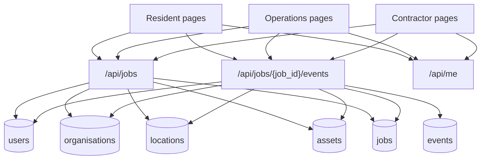

# Architecture

Last updated: `2026-04-04 20:05:00 +11:00`

## Document Metadata

- Owner: `student-living-platform`
- Reviewer: `schema-test-automation`
- Status: `active`

## Overview

The current implementation models one resident-facing job with shared timeline visibility across resident, operations, and contractor actors. Assignment is explicit and can target either a contractor organisation or a direct contractor user.

## System Flow

## Responsibility Stages

| Stage | Typical role | Example actions |
| --- | --- | --- |
| `reception` | resident or reception admin | report creation, intake notes |
| `triage` | triage officer | mark triaged, assignment handoff |
| `coordination` | triage officer or coordinator | schedule visits, on-hold routing, follow-up scheduling |
| `execution` | contractor | start work, mark blocked, complete repair |

## Key Architectural Rules

- assignment and lifecycle status are separate concepts
- contractor read visibility follows recorded dispatch/participation history, while contractor write access still requires the current active dispatch target
- contractor "assigned jobs" queues only show the current dispatch target; historical visibility stays on the job detail page instead of polluting the live work queue
- accountability metadata, lifecycle targets, and assignment snapshots are stored on events instead of being reconstructed only from mutable job fields or free text
- Student Living hierarchy is represented as `University of Newcastle -> Student Living`
